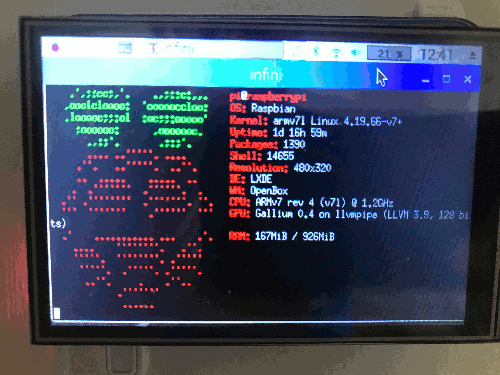

# Infini monitoring on my RaspberryPI

## Prequirements

- RaspberryPI Model 3 b+
- Quimat Raspberry Pi 3 Screen,LCD TFT 3,5 pouces, Touch Screen

# Installation

- Install driver for the screen (https://github.com/caplio/LCD-show)
- Install & configure Pihole (https://github.com/pi-hole/pi-hole/#one-step-automated-install()
- Get weather Script and change your city (https://askubuntu.com/posts/1020693/revisions)
- Install screenfetch (apt)
- Add infini.desktop file on you Desktop
- Add infini.sh on ~/bin/

Enjoy
